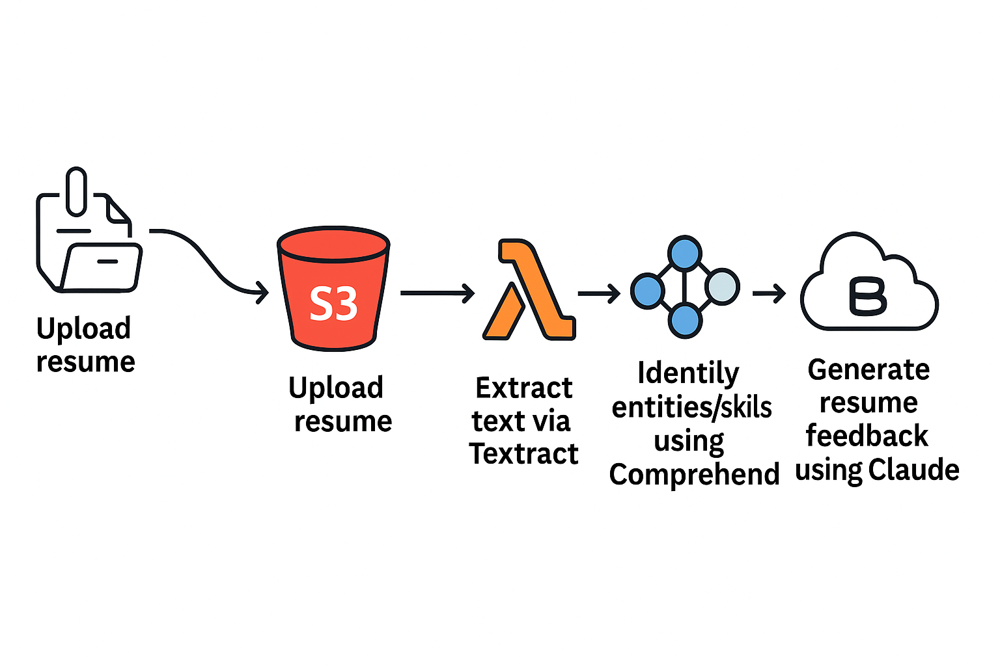

# 🤖 AI-Powered Resume Analyzer using AWS Lambda, AWS Bedrock, Textract & Comprehend

A cloud-native serverless project built entirely on the **AWS Free Tier**, this application extracts resume content from images or PDFs uploaded to an S3 bucket and analyzes them using **Amazon Textract**,**Amazon Lambda**, **Amazon Comprehend**, and **Amazon Bedrock** (Claude v2) to generate AI-driven resume improvement feedback. Accessible and scalable!

---

## 🔍 Project Summary

This project helps job seekers enhance their resumes by:
- Extracting text from uploaded resumes (including images)
- Identifying skills and entities
- Generating intelligent suggestions for improvement using AI

🛠 Built with **AWS Lambda**, **S3**, **Textract**, **Comprehend**, **Bedrock**, and optionally **Amazon Lex** for chatbot interaction.

---

## 🧠 Key Features

| Feature             | Technology Used               |
|---------------------|-------------------------------|
| Text Extraction     | 🟡 Amazon Textract            |
| Entity Detection    | 🔵 Amazon Comprehend           |
| Resume Suggestions  | 🟣 Amazon Bedrock (Claude v2) |
| Resume Storage      | 🟢 Amazon S3                  |
| Processing Logic    | ⚙️ AWS Lambda (Python 3.9)    |
| Interaction (opt)   | 💬 Amazon Lex Chatbot         |

---

## 🧩 Architecture Diagram



---

## 🖥️ Lambda Function - Core Logic

Here’s a simplified view of what happens in the code:

1. **Triggered by File Upload** to S3 bucket.
2. Uses **Textract** to extract lines of text from the resume.
3. Sends extracted text to **Comprehend** to detect skills and entities.
4. Passes text to **Amazon Bedrock (Claude)** to generate AI-powered suggestions.
5. Returns structured output: raw text, list of skills, and tailored feedback.

> 💡 File processed in your current code: `"Pranamika Paul_Cloud_Backend_AWS_AI_Engineer.png"`

---

## 🌐 What You're Building:
A serverless system where you upload a **resume (PDF/image)** to S3, and behind the scenes:
1. **Text is extracted** with **Textract**
2. **Skills/entities detected** via **Comprehend**
3. **AI-powered suggestions** are generated using **Bedrock (Claude v2)**
4. All is handled using **AWS Lambda**, triggered automatically.

---

## 💻 How to Deploy (Step-by-Step)

---

### 🪜 Step 1: Set Up Your AWS Account
- Sign up at [https://aws.amazon.com](https://aws.amazon.com) (Free Tier is fine)
- Create an **IAM User** with permissions for:
- [S3, Lambda, Textract, Comprehend, Bedrock] File [iam_roles.md]
- You can use `AdministratorAccess` for quick setup (not recommended for production)

---

### 🪜 Step 2: Create an S3 Bucket -- File [s3_bucket_config.md]
This is where resumes are uploaded.
1. Go to **S3 Console**
2. Click **Create bucket**
3. Name it: `resume-analyzer-container`
4. Uncheck **“Block all public access”**
5. Click **Create**
6. (Optional) Set up **Event Notification** to trigger Lambda on upload

---

### 🪜 Step 3: Create Your Lambda Function -- File [lambda_function.py]
This handles all the backend logic.

1. Go to **Lambda Console**
2. Click **Create function**
3. Choose:
   - **Author from scratch**
   - Runtime: **Python 3.9**
4. Upload your Lambda code (from `lambda/resumeAnalyzer_pranamika/lambda_function.py`)
5. Assign permissions: File [iam_roles.md]
   - S3: `GetObject`
   - Textract: `DetectDocumentText`
   - Comprehend: `DetectEntities`, `DetectKeyPhrases`
   - Bedrock: `InvokeModel`
6. Set up an **S3 trigger**:
   - Trigger Lambda when a new file is uploaded to the bucket

---

### 🪜 Step 4: (Optional) Set Up API Gateway
To call Lambda via HTTP:
1. Go to **API Gateway**
2. Create **REST API**
3. Set up a **POST method** connected to your Lambda
4. Deploy and note the **public URL**

---

### 🪜 Step 5: Test the Flow -- File [Test_file.md]
1. Upload a PDF/image resume to the S3 bucket
2. Lambda will:
   - Extract text via **Textract**
   - Identify entities/skills using **Comprehend**
   - Generate resume feedback using **Claude (Bedrock)**
3. The output will include:
   - Raw text
   - Skills list
   - Smart feedback

---

## 🧪 Sample Output  [\sample_output.md]
```json
{
  "resume_text": "Experienced Cloud Engineer with AWS & DevOps background...",
  "skills": [
    { "Text": "AWS", "Type": "ORGANIZATION" },
    { "Text": "DevOps", "Type": "OTHER" }
  ],
  "feedback": "You can improve your resume by detailing certifications and quantifying project impact..."
}
```

---

## 🗂 Files You Need to Upload
- `lambda_function.py` → For your Lambda function
- `requirements.txt` (optional) → Only needed if you deploy via CLI with dependencies
- `resumeAnalyzer_pranamika.yaml` → CloudFormation script (optional)
- `architecture_diagram.png` → For documentation

---

## ✅ Deployment Checklist

- [x] AWS Free Tier account setup
- [x] S3 bucket created and permissions set
- [x] Lambda function deployed and triggered by S3
- [x] Textract, Comprehend, and Bedrock permissions granted
- [ ] (Optional) API Gateway and/or Lex bot integration

---

If you'd like, I can give you:
- ✅ Sample Lambda code walk-through  
- ✅ CloudFormation script to automate deployment  
- ✅ Frontend uploader (HTML or React) to complete the project

Let me know how deep you want to go!

---

## 🔗 Live Endpoints (Optional)

If you've exposed it via API Gateway:

```
POST Add your Link 
Example:- https://your-api-id.execute-api.region.amazonaws.com/resume
```

---

## 📸 Screenshots

> Add these manually after deployment:
- ✅ [Lambda Console with function logs](Lambda_console_logs.png)
- ✅ [Bedrock invocation example](BedRock_Invocation.png)
- ✅ [Comprehend output screenshot](Comprehend_output.png)
- ✅ [S3 bucket upload trigger UI](s3_trigger.png)

---

## 🧪 Sample Output

```json
{
  "resume_text": "Experienced Cloud Engineer with AWS & DevOps background...",
  "skills": [
    { "Text": "AWS", "Type": "ORGANIZATION" },
    { "Text": "DevOps", "Type": "OTHER" }
  ],
  "feedback": "You can improve your resume by detailing certifications and quantifying project impact..."
}
```

---

## 📁 Folder Structure

```
📦 AWS-Resume-Analyzer
 ┣ 📄 infrastructure/
 ┣ 📄 lambda/resumeAnalyzer_pranamika/lambda_funtion.py
 ┣ 📄 outputs/
 ┣ 🖼️ architecture_diagram.png
 ┣ 📄 README.md
 ┣ 📄 deployment-checklist.md
 ┣ 📄 resumeAnalyzer_pranamika.yaml
 ┣ 📄 sample-event.json
 ┣ 📄 README.md
 ┗ 📄 requirements.txt (optional)
```

---

## 🚀 Future Improvements

- Add resume upload form using a front-end (React or HTML)
- Chatbot using Amazon Lex
- Store results in DynamoDB
- Multi-language support

---

## 👩‍💻 Author

**Pranamika Paul**  
Cloud | Backend | AWS AI Engineer

🔗 [GitHub Profile](https://github.com/Pranamika-CodeMania/AWS-AI-Projects-2025/tree/CodeMania/AWS-AI-Resume-Analyzer)  
📧 Connect on [LinkedIn](https://www.linkedin.com/in/pranamika-paul-holding-valid-emirates-id-087288141/)


## 📁 Lambda Code
Code is located in `lambda/lambda_function.py`.


🔧 Tools & AWS Services Used (All in Free Tier):

Service	Purpose
Amazon S3	Store uploaded resumes
AWS Lambda	Backend code to extract and process resume content
Amazon Comprehend	Natural Language Processing (NLP) to extract key skills/entities
Amazon Bedrock	Uses Claude AI to generate resume improvement suggestions
Amazon Lex	Creates an interactive chatbot for resume feedback
API Gateway	Creates an HTTP endpoint to trigger resume processing
IAM	Securely control permissions across services

⚙️ Workflow Summary

Upload Resumes → to S3

Trigger Lambda Function → Extract text using Textract

Use Comprehend → Analyze and extract key information

Compare & Rank → Matching against job description based on extracted skills

Store Results → In a database

Display Output → Via API or UI dashboard

✅ Benefits

Reduces HR screening workload

Ensures skill-based candidate shortlisting

Highly scalable and low-code-friendly using AWS services
